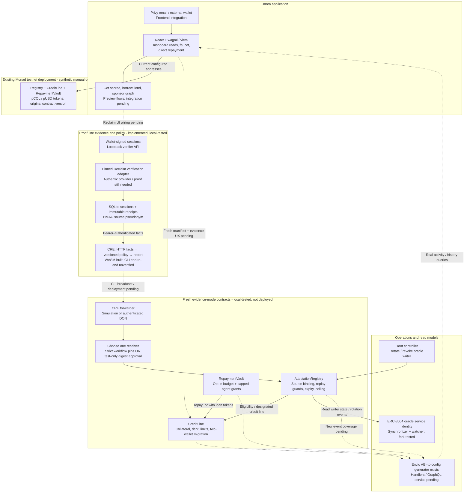
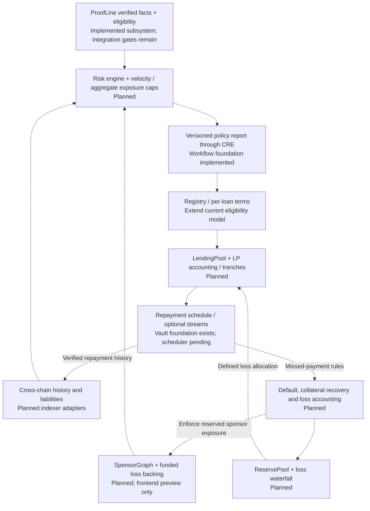

# Unora — Architecture Design

## Evidence-backed credit on Monad: implemented system and target architecture

Updated: 28 September 2026. Reviewed against commit `9e16c6e` and the matching `origin/main` head. This is a code/deployment-record review, not a fresh live-chain or browser acceptance test.

Unora is the product. **ProofLine is its evidence, eligibility and credit-control subsystem**, not a separate competing application. The long-term goal remains undercollateralized lending; the implemented prototype is a **test-token, overcollateralized credit line** with evidence-dependent limits. It does not yet implement the original tranche, sponsor-loss or streaming-credit model.

Status labels throughout:

- **Recorded testnet deployment:** addresses and successful historical transactions are recorded in the repository; not a claim of a current healthy service.
- **Implemented / local-tested:** code and automated/local tests exist, but the complete public-network integration is not demonstrated.
- **Frontend integration:** contract calls or provider wiring exist in the app; this does not imply browser acceptance testing is complete.
- **Preview / planned:** simulated UI or an architectural requirement, not an operational backend.

The prioritized completion checklist is [ARCHITECTURE-CHECKLIST.md](../../docs/ARCHITECTURE-CHECKLIST.md).

## 1. Current system diagram

Solid arrows describe implemented interfaces. Dashed arrows are missing integrations, deployment-dependent delivery, or planned services. Nodes explicitly distinguish code from recorded deployments: a continuous-looking path is not evidence that the whole flow has run successfully.

There are **two contract generations**, not one upgraded deployment. The old five-contract testnet manifest is in [deployments/monad-testnet.json](../../deployments/monad-testnet.json). The app still uses those addresses. Evidence-mode changes require a fresh deployment; modifying Solidity source does not upgrade those old contracts.

## 2. What changed from the original design

| Original concept | What actually exists now | What remains |
| --- | --- | --- |
| `ScoreRegistry` soulbound NFT | `AttestationRegistry`: address-indexed credentials and eligibility reports; no NFT | Decide whether an NFT wrapper is useful; do not represent it as implemented |
| Scoring engine | Deterministic verified-payout tier/ceiling policy | Behavioral scoring, repayment-based growth and calibrated underwriting |
| CRE oracle relay | Workflow fetches verifier facts, applies policy, produces EVM report; two receiver designs | Authentic proof, successful CLI execution and public testnet receipt |
| `LendingPool` with tranches | `CreditLine` with separate demo-token liquidity, deposit/borrow/repay/withdraw | LP shares, redemption, rates, tranches, asset valuation, loss allocation |
| `StreamManager` | `RepaymentVault` with borrower-funded, revocable agent budgets | Scheduler, installment/default semantics; continuous streams only if retained |
| `SponsorGraph` | Frontend graph with sample data | Contract capacity reservation, consent, exposure and default-loss enforcement |
| `ReservePool` | Not implemented | Funding source, reserves, insolvency rules and payout waterfall |
| Cross-chain Envio indexer | ABI-derived Monad event configuration generator | Entities, handlers, GraphQL, reorg handling and cross-chain adapters |
| Wallet onboarding | Privy email/external-wallet integration | Browser acceptance tests; Mera/passkey root remains a separate optional integration |
| Oracle accountability | Root-controlled writer rotation and ERC-8004 service identity tooling | Hosted status service, live registration and operated reconciliation |
| Privacy / Unlink | Minimized onchain report; plaintext verification offchain | No Unlink integration or confidential/ZK financial computation in this repository |

## 3. ProofLine: evidence → eligibility → credit

### 3.1 Session and verification service

[eligibility/server.ts](../../eligibility/server.ts) exposes a loopback-only service:

1. `POST /sessions`: creates a server session and an exact signing challenge.
2. `POST /sessions/:id/authorize`: verifies the borrower's EIP-191 wallet signature and creates the Reclaim request.
3. `POST /sessions/:id/proof`: verifies one proof, validates policy inputs, persists consumption and returns a receipt ID.
4. `GET /facts/:receiptId`: bearer-authenticated, immutable normalized facts for CRE retries.

The signed challenge binds the wallet, application, provider/version, server session, destination chain/registry and validity window. The Reclaim adapter requires reviewed content hashes, cryptographic verification and TEE-attestation verification; it checks the Reclaim session/application context before normalization. SDK operations use bounded child processes and suppress potentially sensitive SDK output.

SQLite persists session authorization, proof/session consumption and receipts across restarts. An HMAC source pseudonym is stable across wallets, proof refreshes and provider versions; test/live data use distinct namespaces. Preserve the source secret and application namespace: changing them can create new identities for the same account.

**Integration gate:** no reviewed, compatible Stripe payout provider or genuine accepted proof is recorded. The adapter is implemented, not an established working Stripe integration. The provider must prove a complete authenticated 90-day window of paid USD payouts, not a user-supplied aggregate. Payouts are not synonymous with income, revenue or future ability to repay. See [provider requirements](../../docs/PROVIDER.md).

### 3.2 CRE's exact role and trust boundary

[cre/eligibility/workflow.ts](../../cre/eligibility/workflow.ts) accepts an opaque receipt ID, fetches facts from the configured verifier using a secret bearer token, requests identical-result aggregation, evaluates the shared deterministic policy, ABI-encodes a report and optionally calls the EVM write capability.

**Reclaim verification currently runs in our verifier, not independently inside every CRE node.** CRE nodes agreeing on the same API response does not eliminate trust in that verifier. CRE's role is policy execution and report delivery over those supplied facts, not proof of unique personhood, confidential computation or independent validation of every financial claim.

The workflow compiles to WASM and has mocked capability tests. Last recorded CLI attempts on 24 September failed during authentication refresh with HTTP 500, before workflow execution. That is historical evidence, not a claim that the endpoint is still failing today. No successful CRE-to-Monad transaction is recorded.

Two delivery options are implemented, with different security:

| Receiver | Authentication | Status / boundary |
| --- | --- | --- |
| `EligibilityReceiver` | Pinned forwarder, workflow ID and owner; chain/registry checks | Local-tested. Workflow ID may start zero (delivery disabled) and be pinned once by the root after final configuration |
| `SimulationEligibilityReceiver` | Pinned mock forwarder plus operator approval of each exact report digest, consumed on acceptance | Test-only; constructor permits Anvil/Monad testnet. Ignores unauthenticated simulation metadata; not DON security |

The registry's writer is the receiver, not the generic forwarder. No paid DON has been deployed. A self-hosted writer remains possible through root-controlled rotation, but that is a centralized alternative and is not an operated fallback service today. Confirm current commercial terms separately; a quoted price is not a protocol constant.

### 3.3 Versioned test policy and report

Policy version: `proofline:payout-policy:v1:test-tokens` (hashed onchain). The code accepts only the configured provider/destination, complete USD facts, permitted test/live mode, a 90-day window and an observation at most one day old. CRE policy assigns expiry seven days after observation.

| Verified 90-day payout total | Tier | Absolute ceiling | Collateral LTV |
| --- | --- | --- | --- |
| $100 to below $1,000 | 1 | 50 pUSD | 50% |
| $1,000 to below $10,000 | 2 | 80 pUSD | 80% |
| $10,000 and above | 3 | 120 pUSD | 80% |

These are demo constants, not validated credit-risk thresholds. Below-minimum evidence is rejected; it does not automatically revoke an older valid credential.

The public report contains destination chain/registry, wallet, source pseudonym, canonical proof digest, session digest, policy version, tier, observation/expiry and ceiling. It excludes raw account IDs, proof bodies and exact payout totals. The verifier sees private proof data and CRE receives normalized totals. Tiers reveal ranges, and public source IDs/wallet migrations are linkable. A private CRE deployment registry does not add confidentiality.

## 4. Onchain enforcement and repayment

### 4.1 Registry and source-account reuse protection

The fresh registry's one-way evidence mode rejects legacy manual-attestation calls. It enforces the fixed policy/ceiling, timestamps, single-use proof and session digests, one source per wallet and one current wallet per source. New observations must be strictly newer; renewal replaces eligibility rather than adding an overlapping payout window.

Source bindings persist after expiry or credential revocation. This stops the **same supported account** from obtaining parallel credit through new wallets or fresh proofs. It does not stop a person owning multiple genuine accounts, collusion, account sale, or double borrowing in unrelated protocols. Sponsor slashing and personhood are not implemented substitutes for these gaps.

### 4.2 CreditLine: today's lending model

For the designated evidence-mode credit line:

`total debt limit = min(collateral × tier LTV, valid eligibility ceiling)`

Remaining borrowing headroom is also capped by available loan-token liquidity. Invalid/expired evidence sets the borrowing ceiling to zero in evidence mode; repayment still works and debt is not erased. The legacy deployment instead returns to its base 50% LTV on expiry. Keep these behaviors distinct in the UI.

Example: 100 pCOL collateral supports at most 80 pUSD of Tier 2 debt. With the demo's assumed 1:1 token value, that is **125% collateralization**, not an 80% collateral requirement. There is no production price oracle, liquidation, interest, repayment due date or default state. `fundLiquidity` is a demo contribution, not an LP investment with redemption rights. Both six-decimal tokens are freely mintable and valueless.

### 4.3 Debt-preserving wallet migration

The old wallet calls `requestMigration(newWallet)`; the new wallet calls `acceptMigration(oldWallet)`. Registry identity, all collateral and all debt move atomically. Destination must have no existing position/source; the old address is retired for eligibility. Migration works after expiry without renewing the credential or reducing debt.

This is consensual migration, **not lost-key recovery**. Already-borrowed wallet tokens, vault budgets/grants and ERC-20 approvals do not move automatically. The user must separately close or revoke old delegations, recover unused budgets and establish new approvals/grants. No production recovery authority exists.

### 4.4 Delegated repayment, not a continuous stream

`RepaymentVault` holds separate pUSD budgets per borrower. Agent grants have a borrower binding, cumulative spending cap, expiry and revocation. Agent keys cannot be reassigned to another borrower. The agent can only repay that borrower's debt through the immutable `CreditLine.repayFor`; it cannot make arbitrary transfers. Anyone may also repay another borrower's debt using their own tokens directly.

A reusable [AutoRepayToggle](../../frontend/components/AutoRepayToggle.tsx) performs approval, confirmed budget funding and delegation in order. It is separate from the main app; no scheduled repayment worker is running. Grants do not renew themselves, and a budget is not proof of future repayment income.

## 5. Frontend: implemented integration versus preview

The main application is in `app/`: React, Vite, Privy, wagmi/viem and React Query. Privy is configured for email and external wallets on Monad testnet. This replaces the original undecided “Dynamic or Privy” architecture; Mera root-account support is not integrated.

| Surface | Observed implementation |
| --- | --- |
| Default dashboard | `useOnchainPosition` reads collateral, debt, limits, token balances, vault budget and attestation from the old testnet addresses |
| Faucet | `FaucetButton` submits real demo-token mint calls |
| Direct repayment | `RepayDialog` has a live approval/repay/receipt flow and a separate simulated mode |
| Get scored | Timed simulated verification/mint, random transaction hash; no verifier/CRE integration. NFT/success wording exceeds backend capabilities |
| Borrow flow | Simulated collateral confirmation and transaction hash; not a live `CreditLine` borrow UI |
| Lend/deposit/withdraw | Product previews; tranche deposits and withdrawals are not backed by a LendingPool |
| Sponsor graph, score ladder, markets | Sample data and planned product mechanics |
| Activity feed | Timer-generated sample events, not Envio events |
| Dashboard `?state=` views | Explicit product-demo scenarios rather than wallet state |
| Auto-repay and wallet migration | Backend/component support exists; main-app integration pending |

The app currently hardcodes the five old deployment addresses in `app/src/lib/onchain.ts`. Replace that with a checked deployment manifest before enabling new evidence-mode features. Never treat preview transaction hashes, advertised market yields or “USDC live” labels in fixture data as proof of a deployed pool.

## 6. Operational services and accountability

- **Root control:** immutable root can rotate/revoke the oracle writer. Writer revocation prevents new writes; it does not automatically invalidate every existing credential. Root compromise remains a major trust assumption.
- **ERC-8004 oracle identity:** registration, consent handling and reconciliation tooling keep one service identity across writer rotation. The watcher checks current state and rotation events. Local-fork tests exist; the recorded fork transactions are not public testnet registration. An HTTPS status endpoint and operated signer/watcher remain pending. This is oracle identity, not borrower personhood.
- **Envio:** the generator uses compiled ABIs for registry, credit-line and vault events. New eligibility/migration events are not yet in its allowlist. Entity schema, handlers, database and GraphQL service are absent; direct RPC reads currently bypass this missing layer.
- **API:** the implemented API is the narrow evidence/session service, not the original general score/loan-offer/sponsor GraphQL API.
- **Scheduler:** no operated auto-repay, rescoring, sponsor recalculation or reserve-health service exists. Evidence expiry is already enforced on access and does not require a cron transaction.

## 7. Target architecture still to build

This diagram preserves the original full-product ambition without presenting it as delivered. Exact economics and interfaces require specification before implementation.

The original `max(prior loan × multiplier, sponsor capacity)` formula is not implemented and should not be treated as a proven Sybil defense. Specify aggregate outstanding exposure, genuinely reserved sponsor capacity, recycling/collusion defenses and who bears losses before adopting a formula. Small successful loans alone do not establish safety for a much larger unsecured one.

An optional score NFT should not become an independent transferable path around source/debt binding. Unlink can remain a separate privacy research track; no integration is shown because none exists here. Any future private identity representation must preserve anti-replay, account-use and debt-continuity invariants. Hiding linkability is not itself a credit-risk solution.

## 8. Completion boundary and recommended scope

**Hackathon vertical slice:** one authenticated source → wallet-bound proof → CRE local simulation → mined Monad testnet eligibility → actual collateral/borrow/repay → account-reuse rejection → debt-preserving migration. Show clearly that simulation/operator approval is not a live DON. Finish this before adding more sponsor integrations.

**Original full architecture:** additionally requires real risk/velocity policies, sponsor loss backing, an LP pool and redemption model, loan schedules/defaults, reserves and live indexed history. These are substantive missing systems, not cosmetic final tasks.

**Real-money readiness:** a separate security/economic/operational acceptance gate; none of the current tests qualifies this prototype for real funds.

## 9. Evidence and integration map

| Integration | Current evidence | Do not claim |
| --- | --- | --- |
| Monad | Old synthetic five-contract testnet manifest; local evidence-mode tests | New receivers or evidence mode already deployed |
| Chainlink CRE | Workflow source, WASM compilation, five mocked capability tests | Paid DON deployment or successful authentic CLI-to-chain delivery |
| Reclaim | Pinned verification/session adapter and binding tests | Genuine Stripe integration completed |
| Privy | Main-app provider and wallet hooks | Mera/passkey governance or browser E2E acceptance |
| Envio | Event-config generator and test | Running indexer, GraphQL or cross-chain debt detection |
| ERC-8004 / agent0 | Oracle registration/watcher and local-fork record | Borrower identity uniqueness or live service registration |
| Nansen / Perpl / Dynamic / Unlink | No implemented integration found in reviewed runtime paths | Active use, bounty eligibility or completed privacy guarantees |
| Alchemy | Configurable RPC can use a supplied endpoint | A dedicated integration demonstrated by a generic RPC URL |

Old bounty amounts/eligibility assertions are intentionally not repeated: confirm the actual submission rules separately.

Last recorded checks from the implementation/push work: 52 Solidity tests, 15 TypeScript tests, five CRE capability tests, successful typechecking/WASM compilation and a synthetic local lending lifecycle. These are not an authentic proof, live DON, frontend E2E or security audit.

Source of truth: [contracts](../../contracts/src), [evidence service](../../eligibility), [CRE workflow](../../cre/eligibility), [frontend](../src), [eligibility runbook](../../docs/ELIGIBILITY.md), [repayment](../../docs/REPAYMENT.md), [oracle identity](../../docs/ORACLE-IDENTITY.md), [indexer status](../../indexer/README.md), and [completion checklist](../../docs/ARCHITECTURE-CHECKLIST.md).
